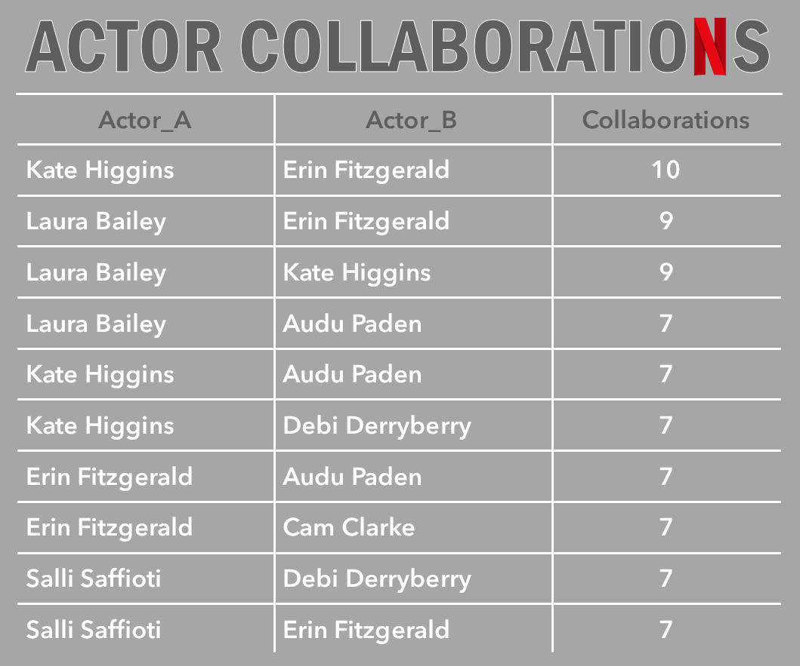
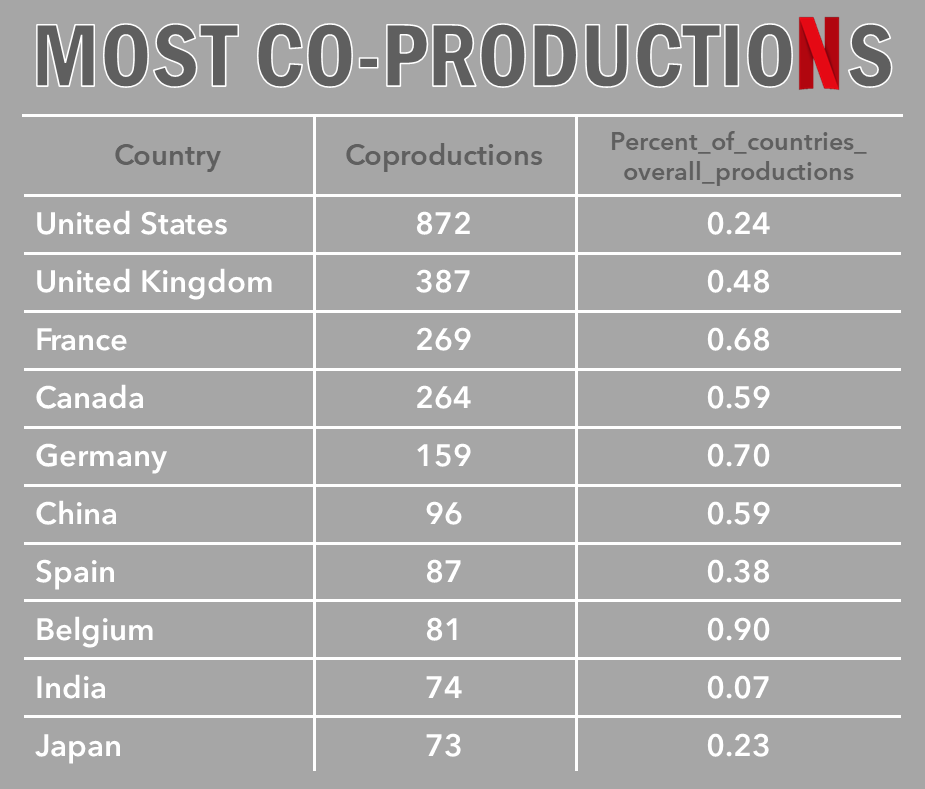
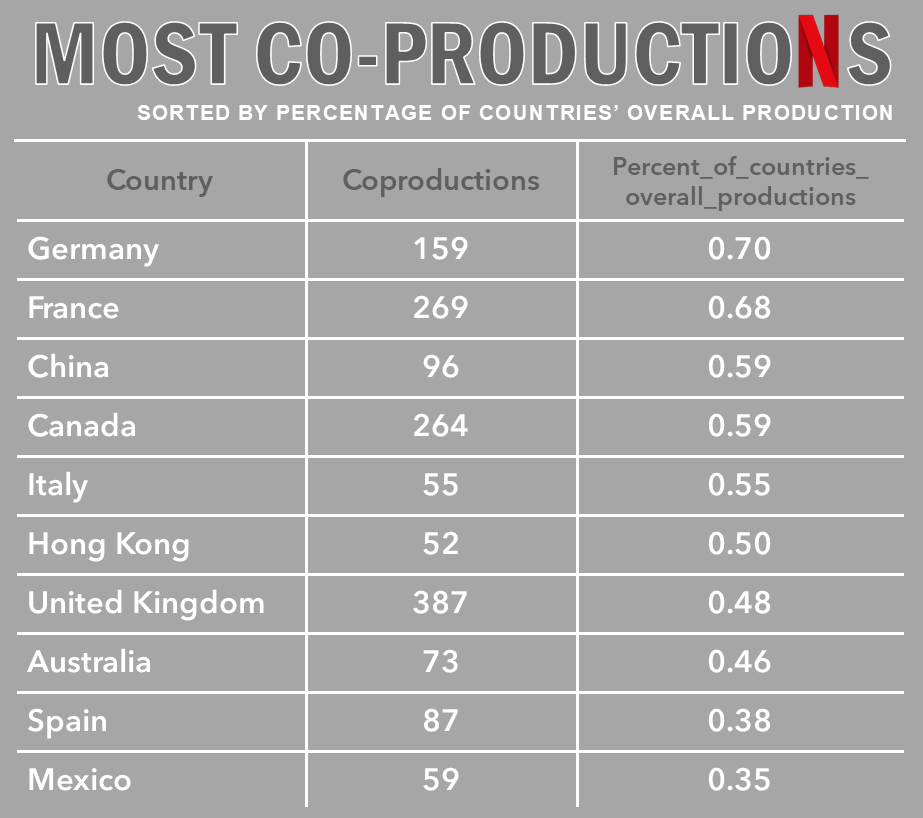
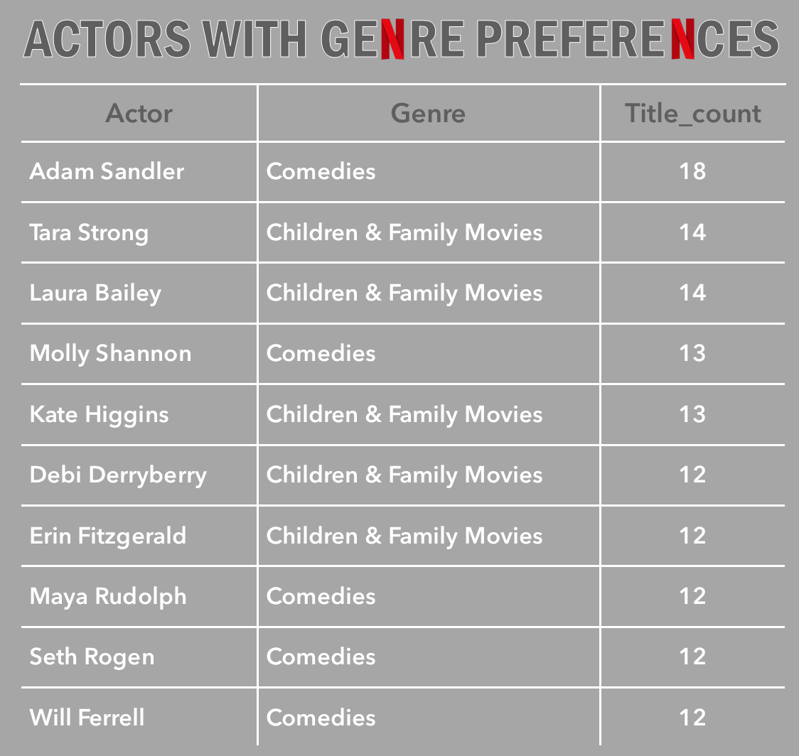
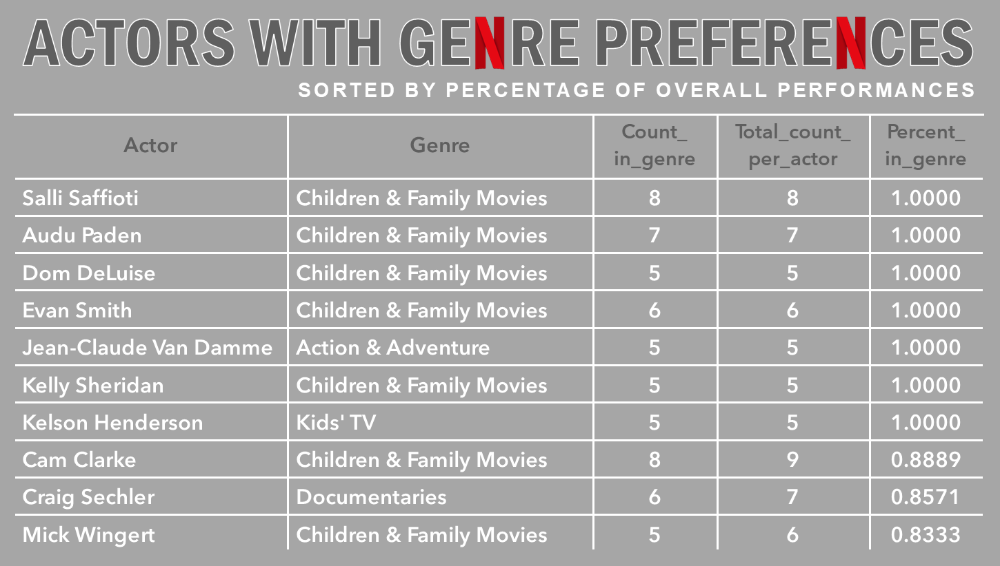
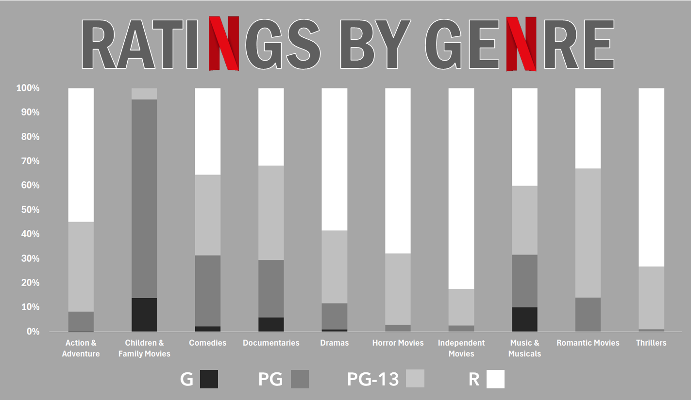

## Cleaning and Preparing a Netflix Dataset project
This project is a data exploration and cleaning case study, undertaken to gain experience with the hygienic and normalizing functions of SQL and PowerQuery. This report will recount the process of preparing a Kaggle Netflix dataset for analysis, along with the performance of a small set of analytical experiments.

### Findings

Working with this dataset offered valuable educational exposure to certain less-than-ideal realities of data handling (such as bumpy importing processes and stubbornly persistent hidden characters). As well, the analyses presented here offered welcome insight into not only the importance of establishing clear definitions and parameters, but also the many challenges that one can encounter when trying to make those determinations.

### Tools used

PowerQuery was used to create bridge (junction) tables to normalize fields in the original dataset that contained multiple comma-separated items.

SQL was used to clean and prepare the data, as well as to perform a number of exploratory analyses on the above-mentioned bridge tables.

### Data import

*Shivam Bansal • Netflix Movies and TV Shows dataset*

[https://www.kaggle.com/datasets/shivamb/netflix-shows/](https://www.kaggle.com/datasets/shivamb/netflix-shows/)

Repeated efforts to employ MySQL Workbench’s Table Data Import Wizard came to grief. I was likewise stymied when I tried to import the CSV using a `LOAD DATA LOCAL INFILE` from within MySQL. Ultimately, I executed the statement via MySQL’s command-line client from the cmd terminal.

Before getting underway, I created a working version of the dataset, `netflix_work`, in order to preserve the original.

*All queries related to the file's import and initial review can be found in the document, **setup.sql**.*


**Initial data examination**

I began by running a `DESCRIBE` query to confirm that the columns had successfully imported in the desired formats.

**Format corrections / Duplicate search**

Because fields in the original CSV’s `date_added` column were written in the “March 30, 2026” style, it was necessary to import them in the `VARCHAR` format. I then employed a `STR_TO_DATE` function to convert them to MySQL’s preferred orientation:
```sql
UPDATE netflix_work
SET date_added = STR_TO_DATE(date_added, '%M %d, %Y');
```
An inspection of a sampling from the dataset suggested that capitalization was a non-issue.

I also ran a query to confirm that the dataset did not contain duplicate rows.

**Empty cells**

The dataset had numerous empty cells apparent at a glance. I ran a query to determine the extent of the NULLs. (Query abridged in the example given below.)
```sql
SELECT
  COUNT(*)                     AS total_rows,
  COUNT(show_id)               AS non_null_show_id,
     COUNT(*) - COUNT(show_id) AS missing_show_id,
  COUNT(type)                  AS non_null_type,
     COUNT(*) - COUNT(type)    AS missing_type,
…
FROM netflix_work;
```
The results indicated that — while there were indeed hundreds of empty strings contained among `netflix_work`’s approximately 8,800 rows — there were in fact zero NULLs.

It is my understanding that, while there is not a universally agreed-upon best practice in such instances, a good argument can be made for the superior analytical firepower of NULLs as compared to empty strings. Accordingly, I opted to convert the empty cells to NULLs. (Query below abridged.)
```sql
UPDATE netflix_work
SET
  show_id = NULLIF(show_id, ''),
  type = NULLIF(type, ''),
  title = NULLIF(title, ''),
  director = NULLIF(director, '') …
```
### NULLs

I then re-ran the “NULL count” query. Most notable among the results was that three categories — `director`, `cast`, and `country` — had significant percentages of NULLs.

The Netflix dataset is a mix of two categories in the `type` column: “Movie” and “TV show.” The significant percentage of NULLs in the `director` column was largely explained by there being no such listing for entries classified as TV shows.

Of the remaining instances, they were largely ephemera — such as comedy specials and “making-of”s — that were classified in the dataset as movies (despite not fitting any conventional definition of that term).

In the case of the many NULL occurrences in the  `cast` field, these were a mix of documentaries, docuseries, reality TV programs, crime TV programs, and international movies and TV shows. (International movies and TV shows were not as well-documented in this area as were their domestic counterparts.)

These repeated oversights — in the `cast` listings for international movies and TV shows — carried over to the `country` field, the lion’s share of whose NULL values were also in those same two “abroad” categories.

### Cleanliness checks

I ran a query on each column to check if its fields were hiding any leading or trailing spaces. Happily, these tests found them free of any such stowaways.
```sql
SELECT column_name
FROM netflix_work
WHERE column_name <> TRIM(column_name);
```
Having determined this, I decided — taking into consideration that this was a well-known public dataset and that the likely risk was low — it would be unnecessary to perform further searches for hidden and/or non-printing characters.

(Ironically enough, although this assumption about the original data would appear to have been correct, hidden characters *would* end up being introduced into the dataset later in the process: See “Hidden characters,” below.)

While reviewing the various columns to ensure that each contained the expected type of data, I discovered a small error in the original dataset: a smattering of titles whose running time was listed in the `rating` field, instead of `duration`.

To correct this, I ran the following corrective query (which took advantage of the fact that movie `duration` fields contained the abbreviation “min” for minutes):
```sql
UPDATE netflix_work
SET duration = rating,
    rating = NULL
WHERE rating LIKE '%min%';
```
​(As for TV shows, their `duration` fields listed number of seasons.)

*All cleaning-related queries can be found in the document, **cleaning.sql**.*

### Building bridge tables

Four columns — most extensively the `cast` and `listed_in` columns, but also those for `director` and `country` — included cells that contained multiple names or identifiers separated by commas.

Fields in the `cast` column, of course, contained actors’ names, while those in the `listed_in` column contained the various possible classifications or genres that might identify the movie or TV show in questions (“drama,” “comedy,” “reality TV,” “crime TV,” etc.)

In order to simplify potential future analyses, I used PowerQuery to create a separate table based on each of these columns. In these “bridge,” or junction, tables, I broke the comma-separated names into individual rows so that — in the newly-created `cast` table, for example — the granularity would be *one distinct row per actor/movie combination*.

**PowerQuery process**

To create these tables, I imported the original dataset into PowerQuery. I then transformed the column in question by splitting it by the comma delimiter — specifically, splitting it into rows — in order to create the desired *one-row-per-actor-title-combination* result.

To eliminate the white spaces that carried over from the field contents’ original comma-separated state, I selected the newly reformatted column and applied *Transform -> Format -> Trim*.

I then deleted those columns not needed for a junction-style table. Each of these newly created tables, then, contained a `show_id` column (i.e., the original table’s primary key); a column for the movie/TV show title; and a column for the now-separated items.

(E.g., where the column name was `cast` in the original dataset, it became an individuated `actor` column in the newly created table. What was once `listed_in` was now `genre`, etc.)

For readability’s sake, I retained the movie/TV show title, although technically the primary-key `show_id` would be sufficient identification: In a larger dataset where size was a concern, the title could be eliminated.

**Import into SQL**

I then loaded the results to Excel and exported each as a separate CSV file: `actor_title_bridge`, `genre_title_bridge`, `director_title_bridge`, and `country_title_bridge`. These then were imported into MySQL Workbench.

Review of these newly created tables revealed a handful of extra, garbled rows that resulted from an errant paragraph return in one of the dataset’s title entries. These unnecessary rows — in which misplaced text made its way into the `show_id` field — were eliminated.
```sql
DELETE FROM actor_movie_bridge
WHERE show_id LIKE '%Flying Fortress';
```

**A note on normalization, granularity, and potential duplicates**

These bridge/junction tables are not fully normalized. For one, they contain redundancies, in that TV show/movie titles were retained for the sake of readability. (Although, as noted earlier, those titles could be removed without affecting the tables’ functionality.)

More to the point, full normalization would require the creation of primary-key IDs for each of the tables along with separate junction tables to connect each to the main table’s `show_id`.

(In a fully normalized system, for example, the `actor` table would consist solely of distinct actor names and a unique `actor_id` assigned to each. In turn, the main table would not contain a `cast` or `actor` column: Instead, a separate `actor <-> title` table would exist that would sync `show_id`s and `actor_id`s according to each actor’s various appearances.)

That said, the bridge tables created for this project will simplify various analyses that would focus specifically on their subjects — say, actors or genres. This would make it unnecessary, for example — in the event that one were using solely the original dataset — to employ criteria that would have to search within multi-item fields using wildcards.

However, because these tables contain many-to-many relationships, any analysis that employs them *must emphasize the potential for duplications in their counts*. For example, whereas the main table encompasses approximately 8,800 individual titles, a listing of genre types along with a count for how many titles are classified in each genre adds up to over twice that amount.

*All queries related to the creation & import of the bridge tables can be found in the document, **bridge_tables_creation**.*

### Hidden characters

As noted above, `cast` and `listed_in` were the two columns most conspicuously in need of bridge tables — virtually every field in these columns contained numerous comma-separated items. I therefore created those tables first and then experimented with some various “test run” queries on the results.

In that process, I discovered a curious behavior: Any effort to filter according to any specific actor’s name was producing zero results.

Suspecting hidden characters, I ran the following query and discovered that, yes, every field’s `orig_length` exceeded its potential `cleaned_length` by 1:
```sql
SELECT DISTINCT actor,
       LENGTH(actor)                                       AS orig_length,
       LENGTH(REPLACE(REPLACE(actor, '\r', ''), '\n', '')) AS cleaned_length
FROM actor_title_bridge
ORDER BY actor;
```
A follow-up query would narrow the culprit down to a carriage return — i.e., `\r` — that appeared at the end of every field’s contents in the newly created column.

In response to this, I cleaned both my newly created `actor_title_bridge` and `genre_title_bridge` tables:
```sql
UPDATE actor_title_bridge
SET actor = REPLACE(actor, '\r', '');
```
Concluding that the carriage returns were most likely an unintended side-effect of the column-splitting performed in PowerQuery, I attempted to “nip the problem in the bud,” as it were, with the subsequent bridge tables that I created.

I would discover, however, that all attempts to eliminate these hidden characters at the source, i.e., within the PowerQuery or Excel environment, would come to naught.

Such efforts as running “Trim” and/or “Clean” from PowerQuery’s *Transform -> Format* menu were not sufficient to eliminate the carriage returns, nor were the TRIM() and/or CLEAN() functions any more effective when applied to the data once loaded to Excel.

Similarly, efforts to replace or substitute the hidden characters with an empty string — whether performed in PowerQuery or in Excel — could not eradicate them: Inevitably, they would appear in the table once imported to SQL.

Although I had hoped that these could be eliminated earlier in the process, I accepted that they could only be removed within SQL, itself, and accordingly applied the aforementioned cleaning query to the `director_title_bridge` and `country_title_bridge` tables, as well.

*All queries related to the cleaning of the bridge tables can be found in the document, **cleaning.sql**.*

### Bridge table analyses

Having created the bridge tables, I wanted to experiment with putting them to use, both with internal comparisons and in conjunction with one another.

**Actor collaborations**

One potentially interesting use to which an `actor_title_bridge` table can be put is employing a self join to determine which actors have most frequently collaborated with one another.

The actual execution of this analysis, though, casts an illustrative light on the various sorts of judgment calls that can be necessary to glean valuable insight from potentially “noisy” results.

For example: In an effort to make the results of such a query more focused, one might specify the content `type` be “movies” (as distinct from TV shows, which are also included in the dataset).

And if one were attempting to make the results more relevant to, say, a primarily American audience, one might also specify the country of production be “United States.”

But even with such guardrails in place, the “top collaborators” results might seem oddly overpopulated with certain recurring — and largely unfamiliar — names. Take the “Top 10,” for instance:

<p align="center">
  
</p>

Subsequent investigation into this output reveals that about 95% of these collaborations spring from the voice-talent cast of a prolific series of animated TV movies known as “Monster High” — making these results of arguably limited interest.

If — in search of more usefully recognizable output — one chooses to control for this series with a `WHERE title NOT LIKE '%Monster High%'` condition, performers from other similar, surprisingly abundant franchises (such as “My Little Pony” and “Power Rangers”) will only take its place to fill the top slots.

And while an argument could be made for excluding these, as well — along with such other examples as the *Kung Fu Panda* and *Spy Kids* films — more celebrated properties such as the *Twilight* and *Rocky* series might seem like better candidates for inclusion. (Not to mention the likes of the James Bond films — whose titles, of course, would not lend themselves to easy filtering.)

This exercise emphasizes the importance of clarifying one’s parameters in advance. Any effort, for example, to produce a “Top 10 Most Frequent Actor Collaborations” list that attempts to exclude franchises/series/sequels, etc., would inevitably have to grapple with fuzzy and potentially arbitrary standards for inclusion.

For what it was worth, I endeavored to create such a non-franchise list — see below — the insights from which ended up being, by default, largely concentrated on the output of Adam Sandler’s “Happy Madison” production house (and the very loyal stable of actors who populate its films).

<p align="center">
  
</p>

Of course, the suggestion could be made that these movies, themselves, while ostensibly distinct from one another, constitute an ersatz franchise of their own — which only further demonstrates the importance of firmly defining one’s relevant terms before embarking upon a such an analysis.

**Co-productions by country**

As with the `actor_title_bridge` table, the `country_title_bridge` table lends itself to an analysis of interaction among the items it catalogs. One example of this would be a query to determine which countries are involved in the most co-productions.

​First, of course, one must determine one’s definition of a “co-production” — whether that be any title with more than one country listed in its `country` field, or whether one prefers to set some higher minimum for the number of required participants.

(In my own instance, I treated the term literally and required only that a title have more than a single country associated with its listing.)

I thought it would also add interesting context to include — in addition to a count of how many co-productions each country has participated in — the percentage that that number represents of its respective country’s overall number of titles.

(For example, it is no surprise that the United States leads the list, with 870 titles, but that amount represents only about 25% of its overall number of productions. Whereas the output of Belgium — number 9 on the list, with 81 titles — is 90% of its own overall total.)

Important note: Of course, as noted above, creating “bridge”-type tables — in which single fields from the original dataset that have multiple, comma-separated items are broken into separate, individual rows — greatly increases the chances for inflated results, making it of utmost importance that relevant context be provided.

In this instance, for example, a single movie/TV show title with, say, four countries listed in the original dataset’s `country` field — will occupy four rows in the `country_title_bridge` table: one row per each title/country combination.

It should be cautioned, then, that the results of such a “co-productions” query cannot be used to calculate any sort of overall totals of individual titles. (For example, a list that showed 150 co-productions for the United States and 50 coproductions for the United Kingdom cannot be taken to reflect 200 total titles. In the unlikely event, say, that all 50 of the UK’s coproductions were with the U.S., the total would, in fact, be just 150 titles between the two.)

A “Top 10” based on number of co-productions, then, would look like this:

<p align="center">
  
</p>

Of course, it might be interesting to see the same results sorted by the percentage figure, instead.

Doing so, however, quickly demonstrates that — the fewer titles a country has listed in the Netflix dataset — the more likely that they are to be co-productions.

In fact, a sort order by percentages produces a “Top 10” list that is almost exclusively countries with limited releases in the dataset. Such a list further highlights, in fact, that — among countries with limited releases — it is commonplace that *all* of their included titles are co-productions with other countries.

Of the 124 countries represented in the Netflix dataset, there are almost 50 whose co-production percentage stands at 1.00. And, of these, over 2/3rds are countries that are represented in the Netflix database by a *single title*.

While these results could, themselves, be the makings for interesting further analysis, the original intent was, implicitly, to determine which of the most prominent entertainment-producing countries (“prominent” as determined by this dataset) had the highest percentage of co-productions with other countries.

I chose, then, to make the cutoff standard for this query a minimum of 100 titles, which produced the following results:

<p align="center">
  
</p>

Of course — speaking of the importance of context — one must keep in mind that all such results should be viewed, by definition, through the lens of specifically what international fare is deemed by Netflix to be of interest to its audience.

**Actors concentrating in particular genres**

These newly created tables also facilitate analyses that focus on the interaction between their respective subjects — such as actors and genres.

One determination of potential interest might be which actors have worked the most in a particular genre. One quickly discovers, though, that such an analysis will again elicit questions of definitions and parameters.

For example, a straightforward query that combined the `actor_title_bridge` and `genre_title_bridge` tables — with criteria to limit the results to United States movie productions — would produce the following:

<p align="center">
  
</p>

The list-topping presence of Mr. Sandler again might invite the question: Do such results unduly favor the busiest performers — i.e., those simply with the most titles — in lieu of potentially more compelling insights?

Perhaps a more nuanced question would be to determine which actors did the majority of their work within a particular genre — based not solely on overall numbers, but instead on the respective percentages of each genre they have worked in as compared to the actor’s overall output?

The potential issue with this approach, of course, becomes immediately apparent when the adjusted results return an unworkably lengthy and ultimately unproductive list of actors each with a single performance. (Each of which, naturally, generates a 100% percentage in whichever genre the title happens to be in.)

There are multiple potential approaches to strike a balance between these two poles. One of the more straightforward is to simply set a required number of films for inclusion in the results. In the query I ultimately ran, I opted for a minimum of five titles.

The results, then, are no longer weighted purely towards those who happen to have numerical superiority in terms of overall titles, although a familiar problem does re-arise — i.e., the results-skewing effect of a series with an inordinate total number of productions. (Yes, fully half of the names below are alums of “Monster High.”)

<p align="center">
  
</p>

Again, how one chooses to address such an issue — or whether one even considers it an issue at all — comes down to the specific situation or question that one is seeking to address: Another reminder of the all-importance of context.

For the sake of illustration, below is the query used to determine these results. *All analysis-related queries appear in the document, **analysis.sql**.*

```sql
WITH US_movie_actor_pool AS (
	SELECT DISTINCT 
        a.actor,
        a.show_id
	FROM actor_title_bridge a
		JOIN country_title_bridge c
			ON a.show_id = c.show_id
		LEFT JOIN netflix_work nw
		    ON a.show_id = nw.show_id
	WHERE c.country = 'United States'
      AND nw.type = 'Movie'
),
titles_count AS (
	SELECT
		actor,
        show_id,
		SUM(COUNT(DISTINCT show_id)) OVER(PARTITION BY actor) AS total_titles
	FROM US_movie_actor_pool
	GROUP BY actor, show_id
),
genre_count AS (
	SELECT tc.actor,
           tc.show_id,
           tc.total_titles,
		   g.genre
    FROM titles_count tc
		LEFT JOIN genre_title_bridge g
			ON tc.show_id = g.show_id
)
SELECT actor,
	   genre,
       COUNT(genre) AS count_in_genre,
       SUM(COUNT(genre)) OVER(PARTITION BY actor) AS total_count_per_actor,
       COUNT(genre) / SUM(COUNT(genre)) OVER(PARTITION BY actor) AS percent_in_genre
FROM genre_count
WHERE total_titles > 4
GROUP BY actor, genre
ORDER BY percent_genre DESC;
```

**Ratings by genre**

One potentially enjoyable analysis that combines multiple tables would be to look at how U.S. movie ratings break down according to genre. (Although the results will prove largely intuitive, they do offer the satisfaction of an “as I suspected”-style reality check.)

As there are over 40 distinct genres as defined in the dataset, the query in question will — for the sake of digestibility — limit itself to the 10 most frequently-listed genres.

Meanwhile, the parameters of the ratings data, itself, are a bit indistinct. Even when one limits the category to “movie,” a search produces a wide array of ratings possibilities outside of the standard U.S. motion picture ratings range of G, PG, PG-13, R, and NC-17.

Primary reasons for this are the many international productions included — which, of course, fall outside of the MPAA’s purview, except in those instances in which a film had a domestic U.S. theatrical release — as well as the inclusion of TV movies within the dataset’s definition of “movie.” (In this latter case, ratings will include TV-Y, TV-14, TV-MA, etc.)

There are, furthermore, two small “unrated” (or “no rating”) categories, UR and NR — the “whys and wherefores” of whose application seem fairly arbitrary. (Note also that the once-notorious NC-17 rating is vanishingly rare — to the point that it has been eliminated, along with the unrated categories, from these results. Of the films in the Netflix dataset that have been given a traditional MPAA rating, less than 2/10s of a percent received the NC-17.)

With these various caveats in place, the results of the breakdown are as so:

<p align="center">
  
</p>

As noted above, the results offer more confirmations than surprises — thrillers and horror movies earning more than their share of R ratings, for example, while the PG attaches primarily to children’s & family fare — although one interesting detail is that independent movies appear to merit the highest percentage of “restricted” ratings, per category, of any type.

### Limitations
• A more useful dataset would have a more precise definition of what qualifies as a “movie” — a category that, in the dataset’s current form, includes an assortment of titles that would qualify in only the loosest sense, if at all. If nothing else, more pointed analyses would benefit from a distinction between theatrical and TV movies, which the dataset currently classifies interchangeably.

• As with any dataset, of course, the quality of information would be improved with fewer empty values. The `country` field is particularly underserved in this area, with almost a tenth of its cells unoccupied. The `cast` field has a similar percentage of blanks, although they are perhaps more explicable — with various documentaries and reality TV programming the source of many of these gaps.

• The inclusion of “international” in the original dataset’s `listed_in` category — where it shares space with more genre-oriented designations such as “drama,” “comedy,” etc. — is of arguable utility. In theory, a film’s “international” status should be determinable with a search of those entries not containing “United States” in their `country` field — except that the dataset is less than rigorous in this regard.

As would be expected, the “international” designation is primarily appended to those titles without U.S. involvement — but, of the over-4000 productions labeled “international,” approximately 250 *do* list the United States in their `country` field, for reasons that are not immediately apparent. (As well, approximately 450 “international” titles have nothing listed in their `country` field at all.)

Unfortunately, this is indicative of a general imprecision in the dataset’s various categorizations, as has been touched upon elsewhere. As it is, “international” seems out of place among the other classifications included in the `listed_in` field, and — because it encompasses so many titles — often ends up, unhelpfully, monopolizing space atop any genre-based analysis

### Next steps
Such a dataset naturally lends itself to a variety of descriptive analyses. Other avenues that I explored, but did not include here, included:

-  Acquisition of titles over time
-  Release dates by decades
-  Number of releases per country
-  Movie run-times by rating
-  Movie run-times by decade
-  Genre trends over time
-  Most popular genres by country
-  Most popular genres, overall
-  Most common genre combinations
-  Longest running TV-shows by genre
-  Rating trends over time
-  Most frequent director/actor collaborations
-  Most frequent director/actor/genre collaborations

The results of these were too prosaic for inclusion. (Nor did they lend themselves as readily to any interesting discussions of the sort of definitional issues that can face an analytical project.)

### What I’ve learned
This project was a healthy introduction to the sort of technical hiccups — recalcitrant imports; obstinate hidden characters — that are, by all accounts, inevitable companions in one’s data analytics journey.

As well, this was much-needed practical exposure to circumstances that demonstrate the importance of framing one’s questions precisely — and just how nuanced even the most seemingly straightforward inquiry can become as one begins to explore the potential results.

This was also a very controlled environment — an exceedingly “clean” dataset, by any standards — in which to be gently exposed to the analytical stumbling blocks created by imprecise data, whether it be missing or misclassified.

As the saying goes, “forewarned is forearmed”!
